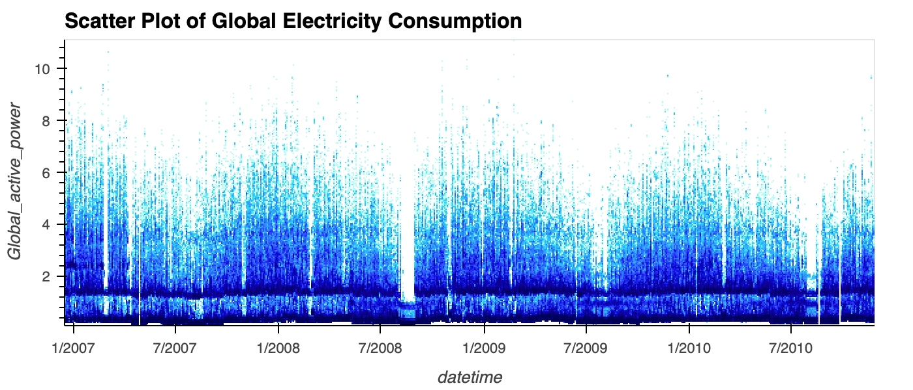

# Assignment: D3 and Big Data

For this assignment, you will explore the world of electricity consumption with 
some simple visualizations using d3.js and datashader/rasterly.

The data is a set of electric power consumption measurements in one household taken
every minute for almost 4 years. The data comprises over 2 million observations
as a time series. 

Please download the data using this Box link: [data link](https://georgetown.box.com/s/mttot9cdo2xvaqb5pf36gxx3ajbmeaf3)

We will be doing this assignment using both R and Python. This assignment will also be structured to mimic reality, so you will have to learn from various websites and adapt code templates to your needs, just like in the real world. <span style="color: red;">Please follow all instructions.</span>

------

### Data download

1. Create a folder named `data` in your GH Classroom repo and download the data file to that folder. The file name should be `household_power_consumption.txt`. 
    - This is a **semi-colon-delimited** file with a header line

### Python and **datashader**

You will develop this section in a file named `shader.py`. All steps must be shown **and commented** in the file, except for package installation steps.

1. Install the packages **hvplot** and **datashader**, as well as the **fastparquet** package. This can be done using 

    ```shell
    conda install datashader
    conda install -c pyviz hvplot
    conda install -c conda-forge fastparquet
    ```

    The [**hvplot**](https://hvplot.holoviz.org/index.html) package makes it much easier to use the [**datashader**](https://datashader.org/index.html) package tools within Python, as we will see. If you have problems installing these packages, reach out to the instructional team **immediately**

2. Load the data into your Python session using **pandas** to create a Pandas DataFrame object. Since this data is semicolon-delimited, you will have to use `pandas.read_delim`. I will call this DataFrame `dat`, but you can choose any valid name you like.

3. We can now plot the full time series (i.e using all the 2 million observations). We will use functionality of the **hvplot** package, where you use an option `datashade=True` in the plotting functions. Please see [this page](https://hvplot.holoviz.org/user_guide/Gridded_Data.html#datashading) for a very nice example of the kind of plot we want here. 

    1. There is a bit of data munging to be done. We have to derive a datetime object from the data. This can be done using 

        ```Python
        dat["datetime"] = pd.to_datetime(dat["Date"]) + dat["Time"]
        ```

        We also need to convert the target variable, `Global_active_power` into a numeric data type (its a string when you import it).

    2. Use `dat.hvplot.scatter` to create a scatter plot of `Global_active_power` against `datetime` utilizing **datashader's** capabilities. Follow the general coding path in the linked page. You will need to import `hvplot.pandas` instead of `hvplot.xarray`, though.

    3. If the figure doesn't show automatically on the IDE you are using, save the figure instance using `f = dat.hvplot.scatter(....)`, where `....` is the actual code you're using to create the plot. Then use `hvplot.show(f)` and the plot will show in your web browser, rendered using the **bokeh** package. Along the right side of the figure, you'll see the universal symbol for save (a floppy disk, for those too young to remember). This will download the visualization as a png file. 

    4. Regardless of whether you create it programmatically or through the IDE, this PNG file needs to be in the repo, named `dshade.png`

4. We will save the data set as a _parquet_ file, called `power.parquet`. This can be achieved through `dat.to_parquet(<filename>)` 

5. This _parquet_ file and the original data file **should not** be committed to the git repository.  To ensure this, add the names of the _parquet_ file and the data file, using relative paths,  inside the existing `.gitignore` file. You can make git ignore the entire `data` folder by adding `data/*` to the `.gitignore` file.  This will ensure that git ignores it. If we see the _parquet_ file or the data file in the repo, or do not see the `.gitignore` file in the repo, **it will be an automatic 1 point deduction**.

### R and d3.js

All R development will be done in a file named `assignment-d3.R` that will be available in your repo. I also suggest doing this in RStudio since it will make development a lot easier

1. Read the _parquet_ file you created earlier into R using `arrow::read_parquet`, which means the `read_parquet` function from the package **arrow**. You may need to install this package. Call the resulting data.frame `dat`

2. Make sure you have the **r2d3** package installed. This automates much of d3 development within RStudio.

3. Create a second data.frame, `dat2`, which will contain the daily total electric consumption at this residence. You will need to group the data by the `Date` variable, and take the sum of the `Global_active_power` variable. Make sure that the `Global_active_power` variable is numeric. 

4. You will find a file, `d3-template.js` in your repo. This is a **d3.js** template for plotting a time series as a line plot, based on a different data set.  Copy this file to `assignment-d3.js` and modify it so that you can plot the data from `dat2` using **d3.js**. The original `d3-template.js` file should remain as is. **Modifying the d3-template.js file instead of making a copy is an automatic 0.5 point deduction.**

    1. If you open the `assignment-d3.js` file in RStudio, you'll see that it comes with a **Preview** button. Once you modify the file, as below, you can click that button to see the results in the Viewer pane. You can modify progressively, working on each piece of the visualization and seeing how that goes before moving on to the next piece. I'd start with making the axes, then plotting the line, then adding the axis labels. 
    2. There are many things to modify, including the name of the data object in line 1, the format of the dates, the names of the variables (typically written as `<data>.<varname>`), potentially the margins so that we can see all the annotation, and perhaps more.
    3. The code for creating labels and titles are commented out using `//`. Once you're done developing the graphic, you must uncomment and modify this code so that we have axis labels
    4. An example final product is available as `template.png`. Your final product has to be **thematically different**. 
    5. Your file should be called `assignment-2.png` or `assignment-2.html` (if you are providing any interactivity)
    
### The final deliverable

1. You must create a web page where each plot will be embedded, with narrative describing each plot, either as captions or as narrative content. 
  
2. This file will be named `index.html` and can be created by any means (Jupyter, RMarkdown, other ways)
  
3. The only requirements are that it is a proper web page that can be seen in a browser, and that both visualizations are in it, either as images (using `</img>` or it's markdown equivalent ``) or as embedded HTML (using `<iframe></iframe>`). 
  

The RMarkdown commands, if you're using it to create the HTML file, are `knitr::include_graphics` and `knitr::include_url` respectively, to be run within code chunks. So, for example
    
````
```{r}

```
````

​        

